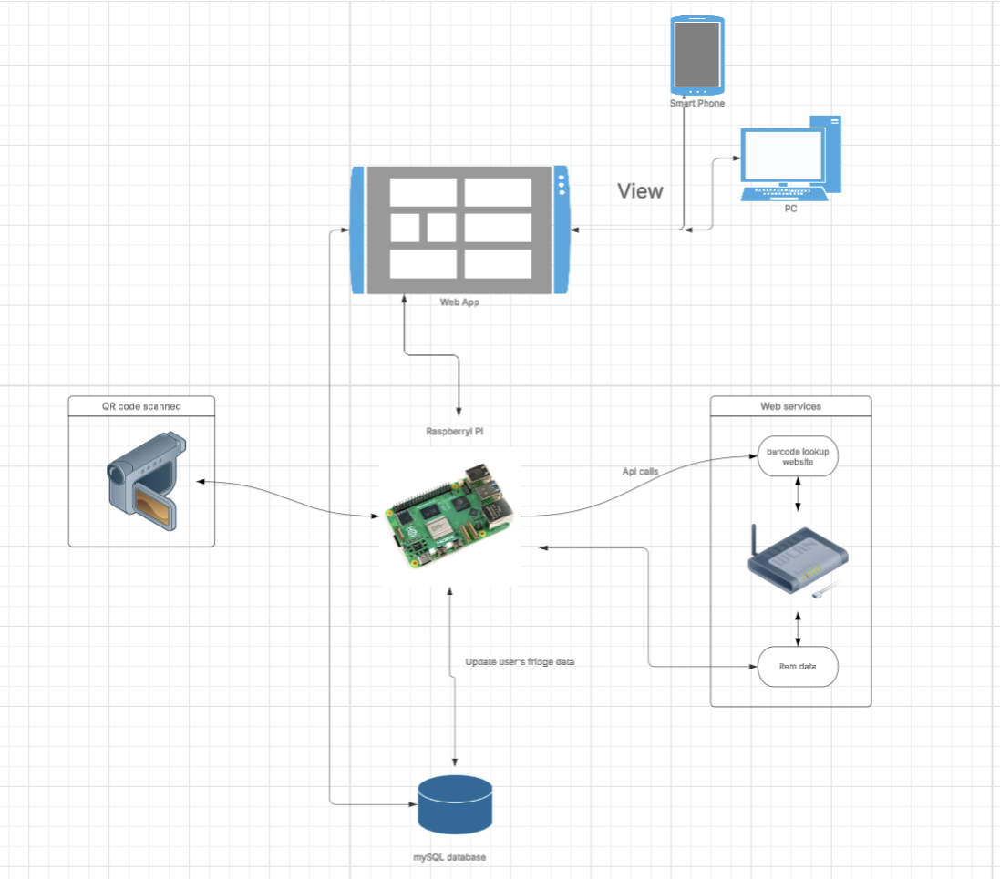

# ECE-140B Team Luma
### Luma--your ultimate kitchen companion to reduce food waste and simplify grocery shopping. With barcode scanning, automatic expiration tracking, and real-time expiry notifications, you’ll never forget what’s in your fridge again. Our sleek, 3D-printed device features a 10” touchscreen and syncs with your phone, keeping your inventory and grocery list always up to date. Smarter shopping, less waste — right from your fridge.

To run the app:
```
docker compose up --build
```
# System Diagram


# Hardware Diagrams


MVP report:

https://docs.google.com/document/d/14wrJte7H5aMp3ZeXIn31BuZPiIkiSkY_qtASQPCsVgo/edit?tab=t.0
